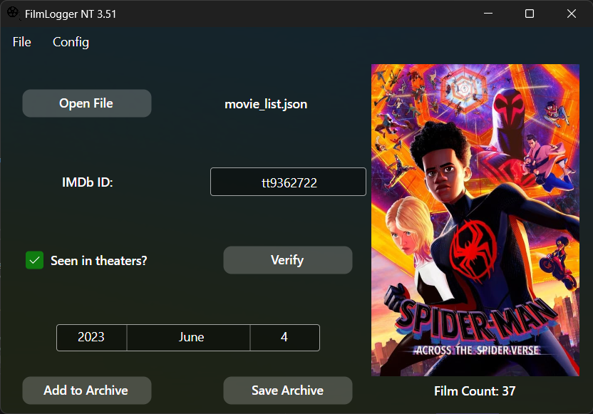

# FilmLogger NT 3.51

   

I built FilmLogger in 2016, and refactored it into FilmLogger v2 in 2021, and we took Python and Tkinter as far as they could go.

It turns out those don't go very far.

Built with Steve Ballmer's next-generation .NET technology, combined with the bold new frontier of the Information Superhighway, FilmLogger has a new lease on life. Welcome to the third generation of FilmLogger software.

And now, with the added power of the new NT Kernel, this is no longer FilmLogger 3.11 For Workgroups. *This,* is:

# FilmLogger NT 3.51

## Description

FilmLogger is an app for Windows and Linux that lets you track what films you watched, when you watched them, and whether you watched at home or at the theater!



When you open FilmLogger, you can start adding films immediately, or open a previously saved archive to add more.

Verify your film using it's IMDb ID code! Films are verified using data services provided by [TheMovieDB.org](https://themoviedb.org).


### **FilmLogger REQUIRES a free TheMovieDB.org Account with your own API Key.**


Once your film has been verified, mark the date and location, and then click Add to Archive. A running count of all films in your archive shows in the corner.

**Remember to save before closing!** FilmLogger will prompt you to save if you try to close the app without saving your newly recorded films. We're friendly like that!

## Data Storage

FilmLogger stores data in an *open* `JSON` format, the `FilmLogger v3 standard`! This standard is user-readable, and follows the example below! If you have trouble opening your saved archive, make sure it looks like this:

```json
[
    {
        "Order":1,
        "ImdbId":"tt1160419",
        "Title":"Dune",
        "Theater":true,
        "Day":21,
        "Month":11,
        "Year":2021
    },
    {
        "Order":2,
        "ImdbId":"tt8097030",
        "Title":"Turning Red",
        "Theater":false,
        "Day":3,
        "Month":4,
        "Year":2022
    },
    ... (and so on)
]
```

Make sure that each film has a unique Order number, and that go from `1..X` in sequence with no gaps. This only matters if you're making the `JSON` file manually; if you use FilmLogger, or any other software compatible with the `FilmLogger v3 Standard`, it will handle the ordering for you.

## License

Copyright © 2023 Jake Landau

This program is free software; you can redistribute it and/or modify it under the terms of the GNU Affero General Public License as published by the Free Software Foundation, either version 3 of the License, or (at your option) any later version.

This program is distributed in the hope that it will be useful, but WITHOUT ANY WARRANTY; without even the implied warranty of MERCHANTABILITY or FITNESS FOR A PARTICULAR PURPOSE. See the GNU Affero General Public License, version 3 for more details.

A copy of the license is attached in the file [`LICENSE.MD`](https://github.com/jakelandau/FilmLoggerDotNET/blob/main/LICENSE.md).

## Dependencies
FilmLogger NT 3.51 uses C# 11 running on .NET 7. It relies upon the following packages:

* Avalonia - v11.0.6 - [MIT License](https://github.com/AvaloniaUI/Avalonia/blob/master/licence.md) - Copyright © .NET Foundation and Contributors
* AsyncImageLoader.Avalonia - v3.2.1 - [MIT License](https://github.com/AvaloniaUtils/AsyncImageLoader.Avalonia/blob/master/LICENSE) - Copyright © 2021 SKProCH
* MessageBox.Avalonia - v3.1.5.1 - [MIT License](https://github.com/AvaloniaCommunity/MessageBox.Avalonia/blob/master/LICENSE) - Copyright © 2019 CreateLab
* TMDbLib - v2.1.0 - [MIT License](https://github.com/jellyfin/TMDbLib/blob/master/LICENSE.txt) - Copyright © 2016 Michael Bisbjerg

FilmLogger's Unit Tests depend upon the following additional packages:
* XUnit - v2.6.3 - [Apache 2.0 License](https://github.com/xunit/xunit/blob/main/LICENSE) - Copyright © .NET Foundation and Contributors
* XUnit.Runner.VisualStudio - v2.5.5 - [Apache 2.0 License](https://github.com/xunit/visualstudio.xunit/blob/main/License.txt) - Copyright © .NET Foundation and Contributors

NOTE: The entirety of FilmLogger is licensed under the terms of the AGPLv3-or-later. The above licenses only apply to these packages when obtained from the upstream sources; the downstream versions distributed in the FilmLogger binary become licensed under the AGPLv3-or-later license through it's viral features.
